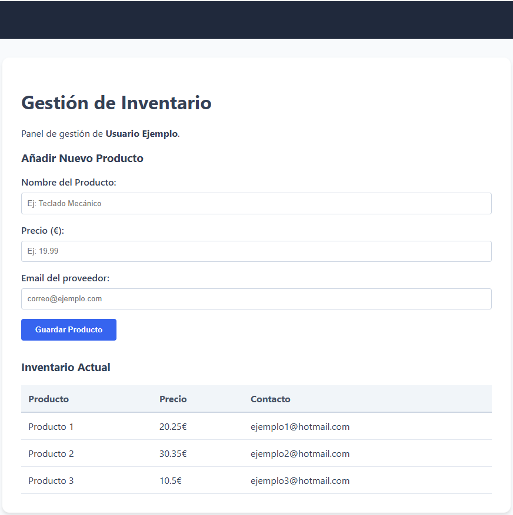

# 🚀 FastAPI Starter - Clean Architecture

Este es un proyecto base (Starter) desarrollado con **FastAPI** que implementa una estructura profesional para la gestión de un inventario simple.

## 🚀 Implementación:

* **Estructura Profesional:** Organización de carpetas siguiendo principios de separación de responsabilidades (app, static, templates, schemas).
* **Motor de Plantillas:** Integración de **Jinja2** para renderizar HTML dinámico desde el backend.
* **Estilos Globales:** Uso de archivos CSS estáticos para un diseño moderno con un Navbar personalizado (**EAN**).
* **Modelos de Datos con Pydantic:** Uso de `BaseModel` para definir y validar la estructura de los productos (Nombre, Precio, Email).
* **Gestión de Formularios:** Captura de datos enviados por el usuario mediante métodos `POST` y uso de `Form` de FastAPI.
* **Persistencia Temporal (In-Memory):** Los datos se almacenan en un diccionario dentro de una lista de Python (`db_temporal`) durante la sesión del servidor.
* **Redirecciones Seguras:** Implementación de `RedirectResponse` con código de estado **303** para evitar el reenvío duplicado de formularios tras el guardado.

## 🛠️ Tecnologías utilizadas:
* **Python 3.14+**
* **FastAPI** (Framework web)
* **Uvicorn** (Servidor ASGI)
* **Jinja2** (Templates HTML)
* **Pydantic** (Validación de datos)
* **UV** (Gestor de dependencias ultra rápido)

## 📦 Estructura de un Producto:
Cada vez que guardamos un producto, Pydantic asegura que tenga este formato antes de entrar en nuestro "diccionario":
- `nombre`: string
- `precio`: float (decimal)
- `correo`: string (email validado)



## 📦 El archivo `__init__.py`
En Python, la presencia de un archivo llamado `__init__.py` dentro de una carpeta transforma ese directorio en algo especial:

* **¿Qué hace?**: Transforma la carpeta en un **Paquete de Python**"*.
* **¿Para qué sirve?**: Permite que otros archivos del proyecto puedan **importar** el código que hay dentro de esa carpeta. Sin este archivo, Python a menudo no "ve" las subcarpetas como módulos usables.
* **Contenido**: Normalmente se deja **totalmente vacío**.

## 📂 Estructura del Proyecto

### 1. `app/models/`
Contiene las **entidades de datos puros**. Aquí se definen las tablas de la base de datos (SQLAlchemy/Tortoise).
* **Función:** Representar cómo se guardan los datos en el disco.
* **Ejemplo:** Modelo `Producto` (id, sku, precio).

### 2. `app/schemas/`
Define los **esquemas de Pydantic** para la validación de datos (JSON).
* **Función:** Validar qué datos entran y salen de la API.
* **Diferencia:** El *model* es para la DB, el *schema* es para el cliente.

### 3. `app/services/`
Contiene la **Lógica de Negocio**. Es el núcleo de la aplicación.
* **Función:** Aplicar reglas de negocio (descuentos, cálculos, procesos).
* **Regla de oro:** No conocen la existencia de la API; solo procesan datos.

### 4. `app/api/`
Define las **Rutas y Endpoints** de FastAPI.
* **Función:** Recibir peticiones, llamar al servicio correspondiente y devolver la respuesta.
* **Nota:** No contienen lógica compleja, solo dirigen el tráfico.

### 5. `app/core/`
Configuraciones globales y constantes del sistema.
* **Contenido:** Conexión a DB, variables de entorno (`.env`), seguridad (JWT) y logs.


## 🛠️ Cómo arrancar el proyecto

Para iniciar el servidor en modo desarrollo con recarga automática, ejecuta:

```bash
uv run fastapi dev app/main.py
```

### Un detalle importante:
Al usar `fastapi dev`, el comando espera encontrar la variable `app = FastAPI()` dentro de `main.py`.